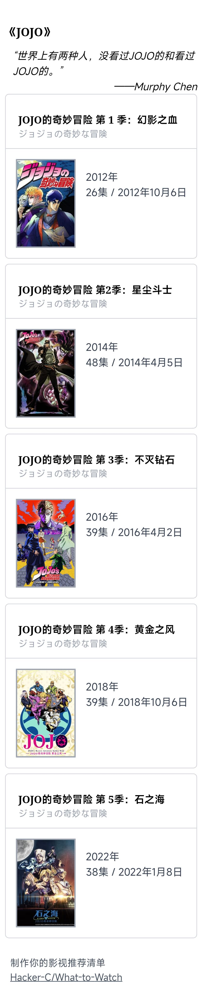

# What to watch

制作你的电影、电视推荐列表卡片。

体验链接：https://wtw.mphy.me （数据来自国外，需要科学上网）

## Dev

```bash
# install
pnpm i
# dev
pnpm dev
# build
pnpm build
```

## Tip

- 接口数据来自 TMDB，需要科学上网，较长时间没有数据，建议切换代理
- 由于 [html2canvas](https://github.com/niklasvh/html2canvas#how-does-it-work) 的图片跨域限制，需先转封面图片为 base64 数据才能下载完整卡片，因此页面数据过多会造成卡顿，建议搜索词尽量精确
- 点击搜索后会对图片进行转 base64 的异步处理，重新搜索可能会造成结果显示异常，建议等待结果加载完毕再重新搜索

## Serve

https://app.netlify.com

## API

接口数据来自： [TMDB](https://www.themoviedb.org/settings/api)

## Demo


