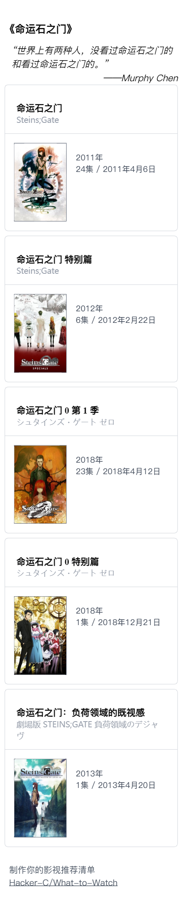

# What to watch

制作你的电影、电视推荐列表卡片。

体验链接：https://wtw.mphy.me （数据来自国外，需要科学上网）

## Tip

- 接口数据来自 TMDB，需要科学上网
- 点击搜索结果即可将电影或电视加入到列表中

## Serve

https://app.netlify.com

## API

[TMDB](https://www.themoviedb.org/settings/api)

## Demo

